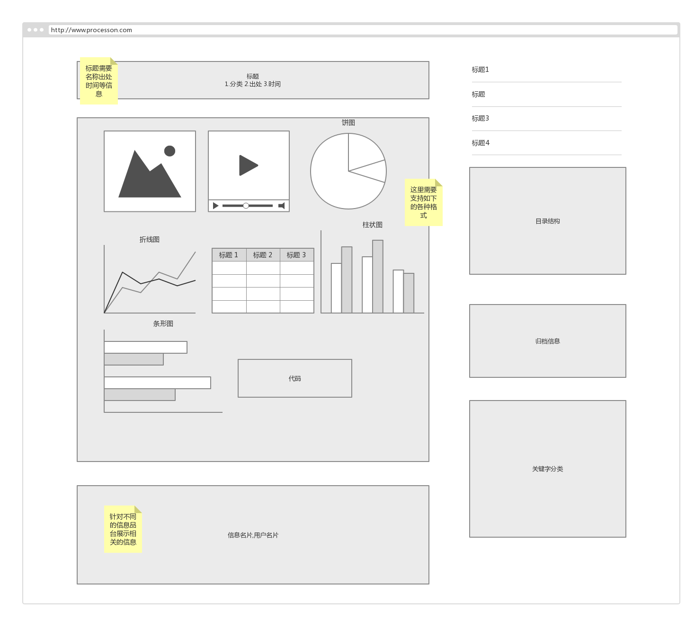
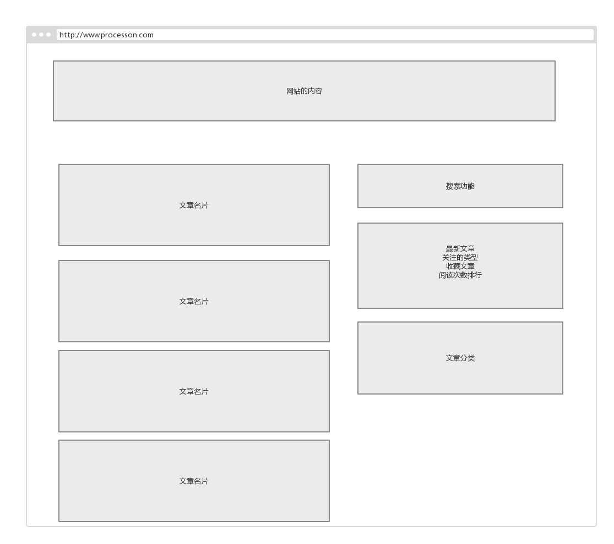

# Magic-book

## 背景分析

信息时代互联网上拥有大量的有用信息，这些信息中蕴含着无法估量的价值，因此当处于现在这个巨大的时代背景的时候，我们更加需要一种快速高效的方法来获取有用的数据，并且对数据进行分析和利用。

## 一期总体目标

实现本项目的基本功能

（1） 后端数据的抓取分析

（2） 前台的展示

（3） 前后端基础业务逻辑的编写

（4） 系统架构的初步确立

## 一期目标初步设计

本项目一期主要针对新闻内容、技术博客内容、行业内信息等文章进行初步的分析和抓取

### 前端需求分析

项目一期针对于文章等信息进行展示，可以参考简书进行设计

#### 文章详情初稿

[可视化图标参考](https://geekplux.com/2017/07/14/what-is-markvis-md.html)

#### 搜索参考我们的主页

#### 首页初稿

